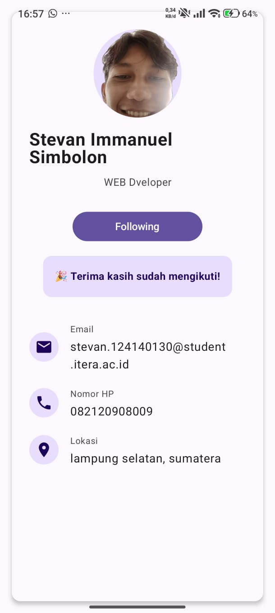

- **Nama** : Stevan Immanuel Simbolon
- **NIM**  : 124140130

# My Profile App

Aplikasi "My Profile App" yang dibangun menggunakan **Kotlin Multiplatform** dan **Compose Multiplatform**. Aplikasi ini menampilkan halaman profil yang berisi:
- Header dengan foto profil (circular) dan nama
- Bio/deskripsi singkat
- List informasi: Email, Phone, Location

Terdapat 3 Composable Functions yang reusable:
1. `ProfileCard`: Membungkus konten profil dengan Card UI.
2. `ProfileHeader`: Menampilkan foto profil melingkar, nama, dan deskripsi/bio.
3. `InfoItem`: Menampilkan baris informasi beserta icon.
s
Komponen yang digunakan dalam aplikasi ini meliputi: `Column`, `Row`, `Box`, `Card`, `Text`, `Button`, `Image`, dan `Icon`.

## Screenshot

### Android


---

## Fitur Tambahan (Bonus)
Aplikasi ini sudah mengimplementasikan AnimatedVisibility pada bagian tombol Follow. Saat tombol diklik, pesan konfirmasi akan muncul dengan animasi *fade in* dan *fade out*.

## Cara Menjalankan Aplikasi

**Melalui Android Studio:**
1. Buka project di Android Studio dan biarkan Gradle melakukan *sync*.
2. Pada menu *Run Configuration* di bagian atas, pilih "androidApp".
3. Klik tombol Run.

**Melalui Terminal:**

- Mem-build APK Android (hasil build ada di `androidApp/build/outputs/apk/debug/`):
  ```bash
  ./gradlew :androidApp:assembleDebug
  ```